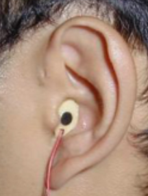
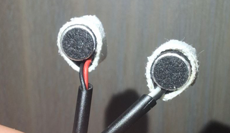
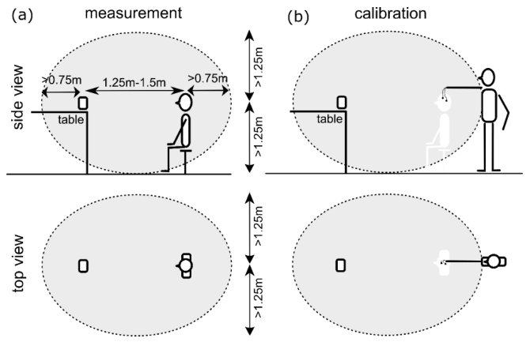
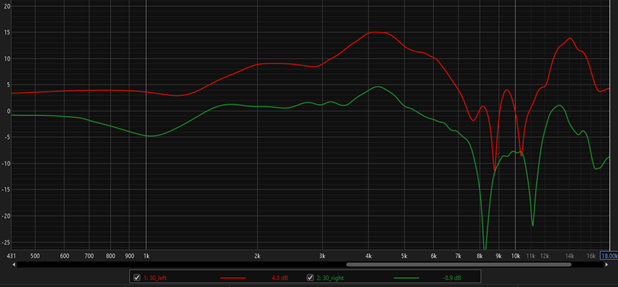
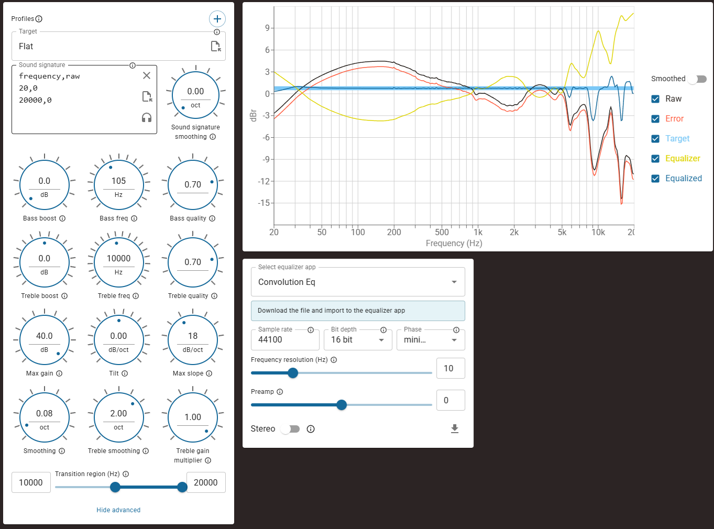

## Introduction

By following the instructions below, you will be able to generate a BRIR with your personal HRTF, as well as an equalization profile specifically to your ears for use with [ASH Toolset](https://github.com/ShanonPearce/ASH-Toolset).

## Microphones

For in-ear binaural recording, the following electret capsules are recommended:

1) Primo EM258;
2) Primo EM172;
3) WM-61A.

Some tips:
1) Use a heat sink while soldering to avoid damaging the microphones;
2) Use foam ear tips to hold microphones firmly in place;
3) Run cables behind ears to maintain stability;
4) Position microphones flush with ear canal entrance.

Example of binaural microphones used:

## Connecting in-ear mics to computer

It is recommended to connect the microphones to some Audio Interface that supports stereo microphones. Otherwise, you can connect the microphones directly to the motherboard.

When connecting, there may be noise, for example, at the mains frequency of 50 Hz and harmonics of 100 Hz, 200 Hz, etc. Make sure there are no grounding problems. Theoretically, by touching the Ground of the binaural microphone wire, the static noise should almost disappear.

## Microphones calibration

You need one Room Measurement Microphone with a calibration file.

For calibration, you need to fasten all microphones together and use a sweep (5.5 seconds length will be enough for all measurements) from Room EQ Wizard. To get .cal files, you need to find "Trace Arithmetic" and subtract the Room Measurement Microphone measurement from the binaural microphone measurements (separately).

## HRTF measurement

First, you conduct measurements with microphones in your ears, after which you position the microphone in place of your head and take another measurement, which will allow you to remove the influence of the speaker and the microphones themselves from the HRTF measurements.
The picture shows how everything should be positioned during the HRTF measurement.

## Processing measurement results

1) For the script to work, you need to save all results in the my_hrtf folder in the following format (500 Hz - 20 kHz):
File name format: {azimuth}_{ear}.txt or {azimuth}_{ear}_{elevation}_elevation.txt
2) Export from REW must include PHASE data ( Frequency(Hz), SPL(dB), Phase(deg) ).
3) Use IR Windows to remove reflections.
4) To remove the influence of the speaker and microphones, use "A / B", where A is the measurement with the microphone in the ear, and B is the measurement with the microphone in the air.

An example of my measurements for an azimuth of 30 degrees:

## Measuring headphone FR

To measure headphones, again use sweep from Room EQ Wizard. Next, you need to invert the headphone FR and save as min-phase. Then you can apply this file as an equalizer with convolution in Equalizer APO. Also use "Replicate Data Outside range" otherwise the .wav with min-phase may have artifacts. When exporting, use Samples = 32k.

When inverting the frequency response at low and high frequencies, you may get huge gain. In this case, it’s best to use AutoEQ to create an inverted FR instead of REW. Deep dips in the frequency response should be ignored.

An example of my measurements of the Sennheiser HD 650 and the inverted curve (AutoEQ - https://autoeq.app/):

It is important to remember that the acoustic impedance of headphones differs from the impedance of free field, which leads to inaccuracies that cannot be completely eliminated without measurements directly at the eardrum.

## Additional headphone correction

ASH-Toolset now includes a "Diffuse-field Calibration - Retain Diffuse Field" option on the "Additional Tools & Maintenance" tab. This feature preserves the complete HRTF (including both DTF and CTF components) during processing, ensuring accurate headphone equalization without requiring additional correction steps.

## How to use the script to generate .sofa

### 1. Environment setup

Install Python (version 3.9+).
Install all necessary libraries using the following command::

`pip install -r requirements.txt`

### 2. Preparing measurement files

The script looks for text files with measurements in the folder specified in the INPUT_FOLDER variable (default is my_hrtf).

File name format:  `{azimuth}_{ear}.txt` (for all directions with zero elevation) or `{azimuth}_{ear}_{elevation}_elevation.txt`.

Azimuth: A number from 0 to 360 degrees. 0 is in front of you, 90 is to your left, 180 is behind you, and 270 is to your right.
Ear: 'left' or 'right'.
Elevation (optional): If the measurement is at ear level, you don't need to include this. If it's higher or lower, add `_10_elevation` (for +10 deg) or `_-10_elevation` (for -10 deg).

Examples:
0_left.txt (Center, left channel, ear level 0 degrees)
30_right.txt (30 degrees, right channel)
45_left_15_elevation.txt (45 degrees, left channel, +15 degrees up)

Text files must contain three columns: **Frequency**(Hz), **SPL**(dB), **Phase**(deg).

### 3. Script configuration

Open generate.py in a text editor. You are interested in the settings block at the beginning of the file.

1) Measure your head width and enter the value in `HEAD_WIDTH_CM`;
2) `APPLY_TREND_BALANCE`. If True, the script will attempt to automatically correct the volume imbalance between the left and right ears based on symmetry.
3) `MIRROR_MODE`. 
"NONE" - No mirroring.
"LEFT_TO_RIGHT" - Data from the left hemisphere (0-180 deg) is copied and mirrored onto the right.
"RIGHT_TO_LEFT" - Data from the right hemisphere (180-360 deg) is copied to the left.
4) "INPUT_FOLDER" - specify the folder where your measurements are stored.

If ALLPASS does not work correctly with your measurements, you can set "MAX_ALLPASS_SECTIONS = 0".

### 4. Running

Run the script with the command:
`python generate.py`

### 5. Result

The .sofa file will appear in the script folder.
Also, plots will appear in the hrtf_processing_plots folder to verify that the script worked correctly.

## Applying the results

Apply the inverted curve obtained in the "Measuring headphone FR" step in Equalizer APO (Advanced Filters - Convolution)

In ASH-Toolset, select a suitable Acoustic Space. (The best results are obtained with Audio Lab A and Control Room.)

Select or create your Room Target.

Headphone Compensation and Headphone Correction should be disabled.

On the Listener Selection tab, your .sofa file should be selected.

On the Low Frequency Extension tab, select settings to your taste.

On the Additional Tools & Settings tab there is an Early Reflections (ms) setting. By default it is set to 0.5 ms, which is actually about 2-2.5 ms. Increase to 3-3.5 ms (actually 5-6 ms) to get reflections like in a small room.
